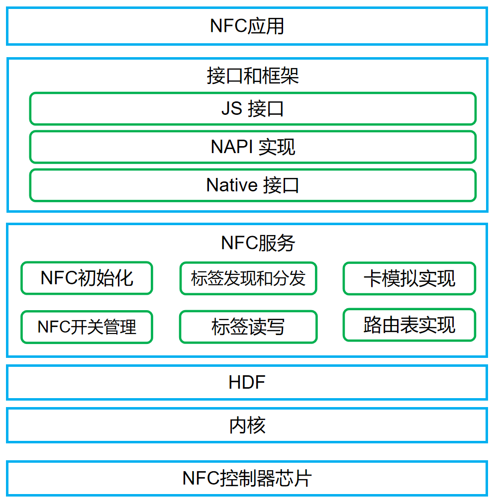

# NFC组件<a name="ZH-CN_TOPIC_0000001124412109"></a>

-   [简介](#section11660541593)
-   [系统架构](#section342962219551)
-   [目录](#section161941989596)
-   [约束](#section119744591305)
-   [说明](#section1312121216216)
-   [使用说明](#section129654513264)
-   [相关仓](#section1371113476307)

## 简介<a name="section11660541593"></a>

近距离无线通信技术\(Near Field Communication，NFC\) ，是一种非接触式识别和互联技术，可以在移动设备、消费类电子产品、PC和智能设备间进行近距离无线通信。

OpenHarmony中NFC服务提供有源标签读写能力。

## 系统架构<a name="section342962219551"></a>

**图 1**  NFC组件架构图<a name="fig444313176464"></a>  




<a name="table1716174620235"></a>
<table><thead align="left"></thead>
<tbody></tbody>
</table>

## 目录<a name="section161941989596"></a>

```
/foundation/communication/nfc
├── interfaces                        # 接口代码
│   └── kits
│       └── native_cpp                # 本地SDK库
│           └── connected_tag_base    # NFC有源标签SDK实现
│           └── napi                  # native api
│               └── connected_tag     # NFC有源标签native api
└── sa_profile                        # 服务属性声明
│   └── connected_tag                 # NFC有源标签服务属性声明
└── services                          # 子系统服务代码
    └── connected_tag                 # NFC有源标签服务
        ├── etc                       # 系统服务配置
        ├── include                   # 头文件
        └── src                       # 源文件
```

## 约束<a name="section119744591305"></a>

设备必须具备有源标签芯片，才能使用有源标签的读写服务。

## 说明<a name="section1312121216216"></a>

### 使用说明<a name="section129654513264"></a>

-  有源标签的读写

设备必须具备有源标签芯片，才能使用有源标签的读写服务，参考“js-apis-connectedTag.md”有源标签开发指南。


## 相关仓<a name="section1371113476307"></a>

hmf/communication/nfc

